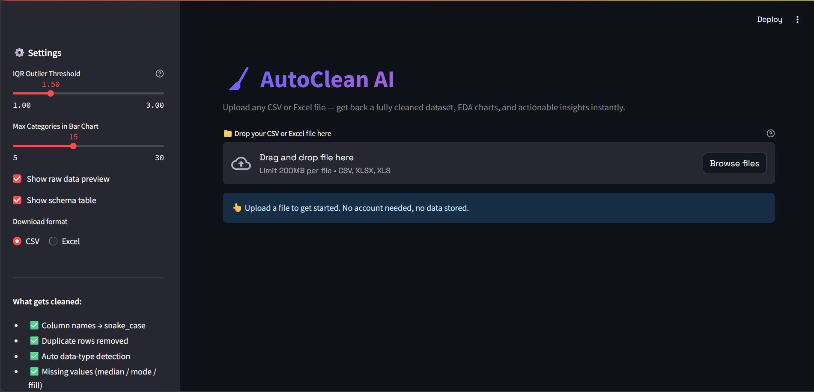
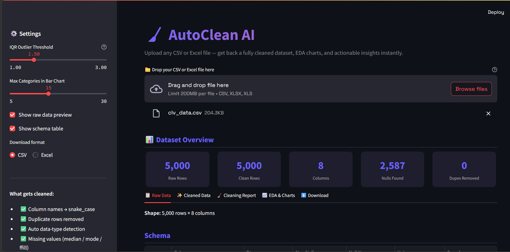
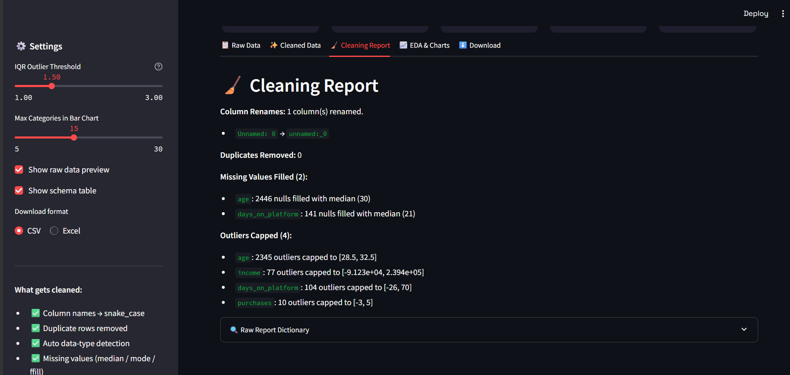
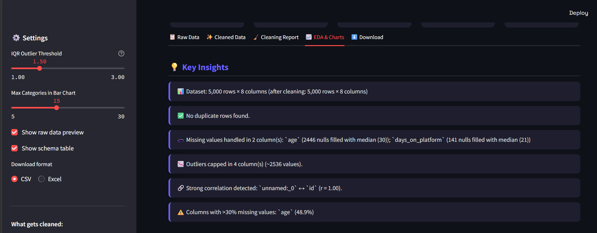

# 🧹 AI-Data-Preprocessing
Project Live  : https://ai-data-preprocessing.streamlit.app/

> Upload any CSV or Excel file — get back a fully cleaned dataset, EDA charts, actionable insights, and the exact Python code that cleaned it — instantly.

---

## 📁 Project Structure

```
AI-Data-Preprocessing/
├── main.py                        ← Streamlit UI (entry point)
├── cleaning.py                    ← All data cleaning logic
├── eda.py                         ← EDA: charts + text insights
├── utils.py                       ← File I/O, logging, helpers
├── full_preprocessing_tutorial.py ← Standalone, commented learning script
├── requirements.txt               ← Python dependencies
└── README.md
```
DEMO PICTURES





---

## 🚀 Quick Start

### 1. Install dependencies
```bash
pip install -r requirements.txt
```

### 2. Run the Streamlit app
```bash
streamlit run main.py
```

Open your browser at **http://localhost:8501**

Or just use the live app — no setup needed: **https://ai-data-preprocessing.streamlit.app/**

---

## 🖥️ App Tabs

| Tab | What it shows |
|-----|----------------|
| 📋 Raw Data | Original uploaded data + schema summary |
| ✨ Cleaned Data | Fully cleaned dataset + numeric profile |
| 🧹 Cleaning Report | Human-readable summary of every fix applied |
| 📈 EDA & Charts | Insights, summary stats, null charts, correlation matrix, boxplots, distributions, categorical counts |
| ⬇️ Download | Download the cleaned dataset as CSV or Excel |
| 🧑‍💻 View Code | The **actual source code** that cleaned your file — every cleaning function shown with a plain-language explanation, right in the app |

---

## 🧹 What Gets Cleaned

| Issue | Method |
|-------|--------|
| Column names | Lowercase + snake_case |
| Duplicate rows | Exact match removal |
| Wrong data types | Auto-detection + conversion |
| Missing values (numeric) | Median fill |
| Missing values (datetime) | Forward/back fill |
| Missing values (text) | Mode fill |
| Outliers | IQR capping (configurable threshold) |
| Categorical inconsistency | Strip + title-case normalization |
| Mixed date formats | `pd.to_datetime` with inference |
| Mixed number formats | Strip commas, convert to float |

---

## 📊 EDA Features

- **Summary statistics** — describe() + dtype + null %
- **Missing value heatmap + bar chart**
- **Correlation matrix** (Pearson, numeric columns)
- **Distribution plots** — histogram + KDE per numeric column
- **Categorical bar charts** — value counts
- **Boxplots** — outlier visualization (z-normalized)
- **Text insights** — auto-generated bullet points

---

## 🧑‍💻 View Code Tab

After downloading your cleaned file, open the **🧑‍💻 View Code** tab to see the
exact code that just ran on your data — not a generic summary. Each cleaning
step (column renaming, duplicate removal, dtype fixing, categorical
normalization, missing-value handling, outlier capping) is shown in its own
expander with:
- A short explanation of what the step does and why
- The real Python source of the function that did it

Great for learning pandas, verifying what happened to your data, or copying
the logic into your own project.

---

## 📦 Dependencies

```
streamlit, pandas, numpy, matplotlib, seaborn, openpyxl, xlrd
```

---

## 💡 Tips

- **CSV support:** comma, semicolon, tab, pipe delimiters auto-detected
- **Encoding:** UTF-8, Latin-1, CP1252 tried automatically  
- **IQR threshold** is adjustable in the sidebar (1.0 = aggressive, 3.0 = conservative)
- **Download** as CSV or Excel directly from the UI
- **View Code tab** shows exactly how your data was cleaned, function by function

---

## 🎓 full_preprocessing_tutorial.py — Learn the Concepts

A standalone, heavily-commented script (`full_preprocessing_tutorial.py`) is
included for learning purposes. It runs the entire preprocessing pipeline
step-by-step on a small built-in sample dataset and prints an explanation of
each stage as it runs:

1. Loading raw data
2. Initial exploration (`shape`, `dtypes`, `head`, `isnull().sum()`)
3. Handling missing values (`isnull`, `dropna`, `fillna` with mean/median/mode/ffill/bfill)
4. Removing duplicates (`duplicated`, `drop_duplicates`)
5. Fixing data types (`pd.to_numeric`, `pd.to_datetime`)
6. Handling outliers (IQR method + capping)
7. Cleaning text/categorical columns (`strip`, `lower`, `title`)
8. Encoding categoricals (Label Encoding vs One-Hot Encoding)
9. Feature scaling (Min-Max normalization)
10. Exploratory Data Analysis (`describe`, `value_counts`, `corr`)
11. Saving the cleaned dataset to CSV

Run it directly — no arguments needed:
```bash
python full_preprocessing_tutorial.py
```
It works on its own sample data, and every function can also be imported
and reused on your own DataFrame.